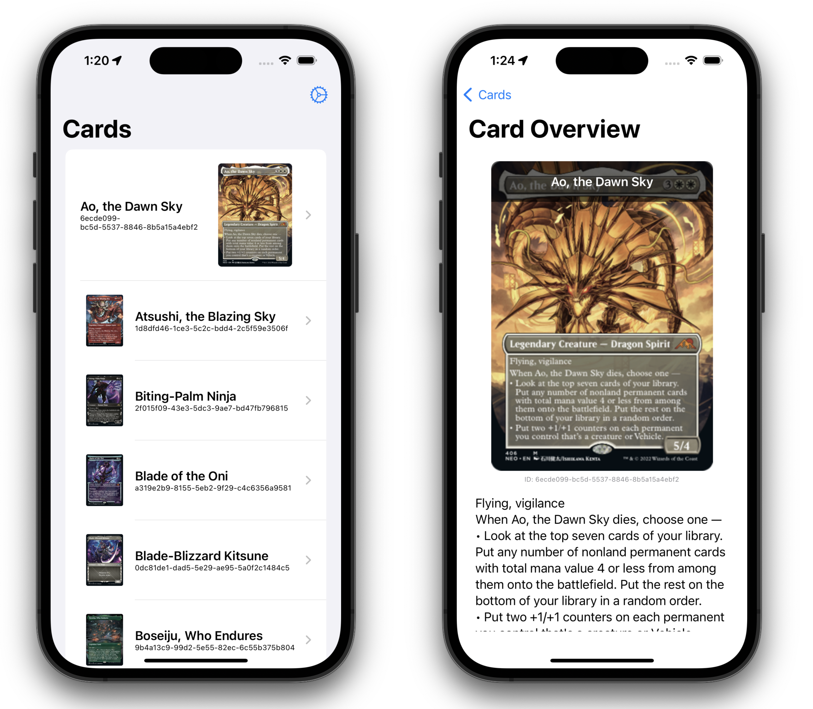
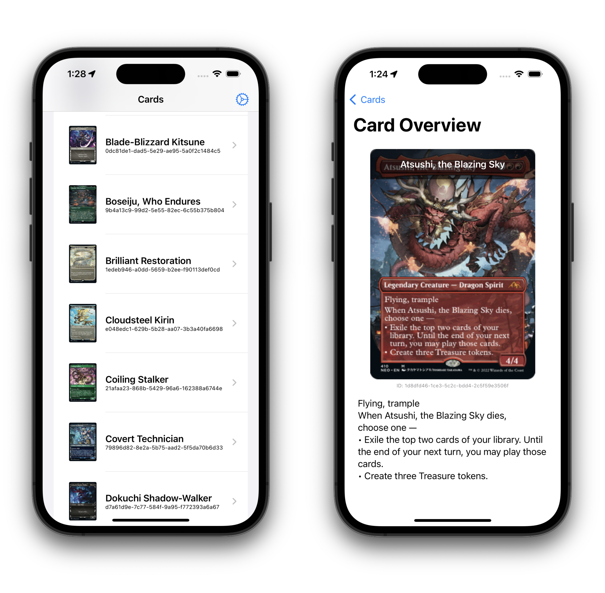

# Cards App

This iOS application was developed as a part of my university course on iOS development, utilizing Swift UI. It
showcases a collection of cards and efficiently manages them by storing them in a local database. Moreover, the app
offers users the ability to configure their preferences.

## Technical Details

* **Architectural Foundation:** The app is built following the MVVM architecture.
* **Local Data Storage:** CoreData is employed to locally store the cards.
* **User Preferences:** UserDefaults are used for managing user-specific settings.
* **User Interface:** SwiftUI is used to create the app's user interface.